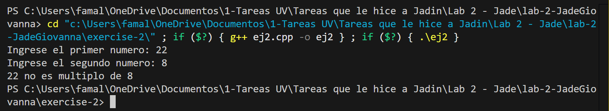

# Ejercicio de laboratorio 2 – Múltiplos

## Descripción

Escriba un programa que lea en dos números enteros y determine e imprima si el primero es un múltiplo del segundo. [Sugerencia: use el operador de módulo.]

```cmd
Ingrese dos enteros: 22 8
22 no es un múltiplo de 8
```

## Contesta las siguientes preguntas

1. ¿Se puede utilizar el operador de módulo con operandos no enteros? ¿Se puede usar con números negativos? Supongamos que el usuario ha introducido los siguientes conjuntos de números. Para cada serie, ¿qué produce en la tercera fila? Si hay un error, explique por qué.
1.- No se pueden ocupar decimales
2.- Si se pueden ocupar números negativos
3.- Produce un error, ya que no se puede dividir entre 0

   | Entero 1 | Entero 2 | Expresión        | Salida         |
   | -------- | -------- | ---------------- | ---------------|
   | 73       | 22       | cout << 73 % 22; | No es multiplo |
   | 0        | 100      | cout << 0 % 100; | Si es multiplo |
   | 100      | 0        | cout << 100 % 0; |     Error      |
   | -3       | 3        | cout << -3 % 3;  | Si es miltiplo |
   | 9        | 4.5      | cout << 9 % 4.5; | No es Multiplo |
   | 16       | 2        | cout << 16 % 2;  | Si es multiplo |

2. ¿Qué pasa si colocamos un punto y coma (;) después del final de la expresión de condición de una declaración if?
R = Se ocaciona un error lógico, nunca se ejecutara el código de la declaración if, ya que, la condición se interpretara cómo una sentencia vacia por el ; después de la expresión de condición del if

3. Modifique el programa para determinar si un número ingresado es par o impar. [Nota: Ahora, el usuario necesita ingresar solo un número.]

## ✅ Resultado


